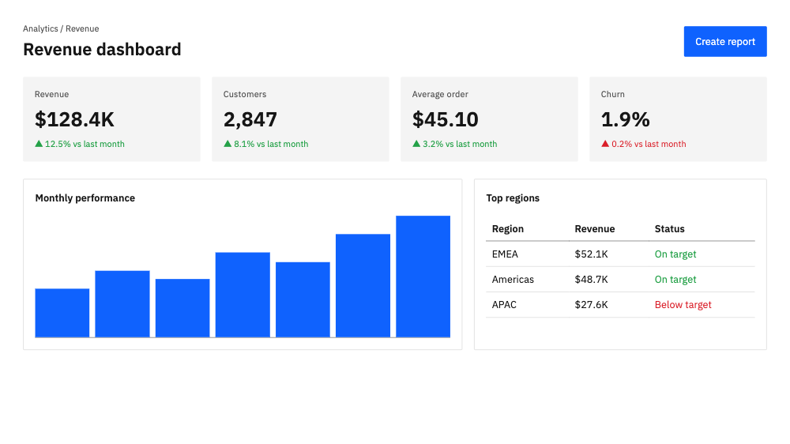
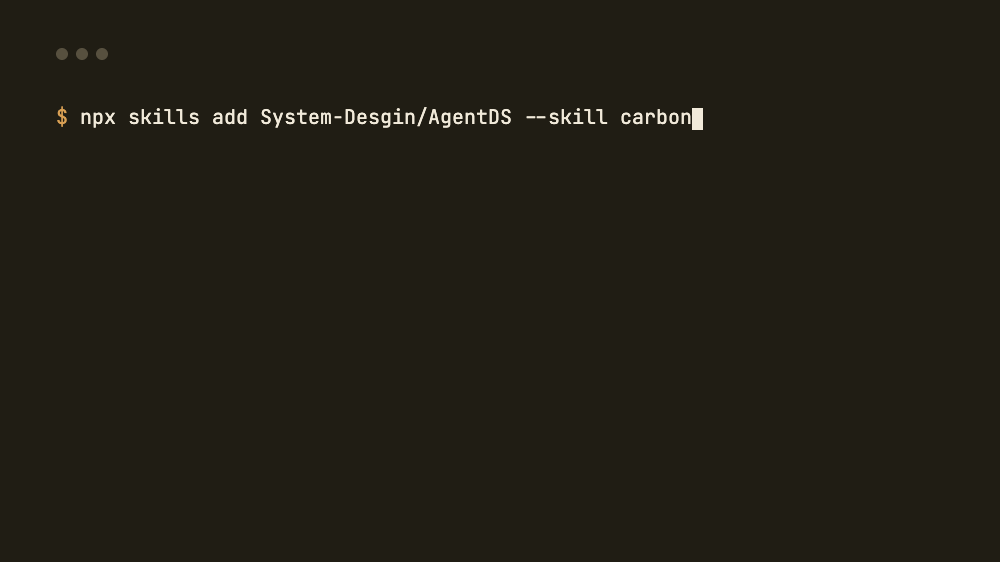

# AgentDS

[](https://www.skills.sh/)
[](https://github.com/System-Desgin/AgentDS/actions/workflows/ci.yml)
[](./LICENSE)
[](./content/LICENSE)

> Source-verified official design systems for coding agents. AgentDS translates
> published token packages and repositories into `DESIGN.md`, DTCG tokens, and
> Tailwind CSS—with provenance and a verification report for every published
> file.

- **Web:** https://agent-ds.oday-bakkour.com
- **API:** https://api.agent-ds.oday-bakkour.com (read-only, no key)
- **Install:** `npx skills add System-Desgin/AgentDS --skill design-systems`
- **License:** code Apache-2.0 · catalog content ([`content/`](./content)) CC BY 4.0
- **Contact / security:** contact@oday-bakkour.com

> **Catalog status:** 42 entries: 27 Official Systems and 15 Brand Looks. 41 are
> published; the Figma Brand Look remains a draft behind the human QA gate. The
> `skills/` directory and public API are live.

## See the tokens at work

[](https://agent-ds.oday-bakkour.com/systems/carbon/preview/dashboard)

The [live Carbon preview](https://agent-ds.oday-bakkour.com/systems/carbon/preview/dashboard)
is server-rendered directly from the catalog's `DESIGN.md` tokens. Its source is
`@carbon/styles@1.110.0`; the current verification report records exact matches
for all 12 published color roles. It is an approximation of Carbon's visual
language, not IBM's official component library.

### From install to on-system UI



## Try Carbon in 60 seconds

Install the catalog skill from skills.sh:

```bash
npx skills add System-Desgin/AgentDS --skill design-systems
```

Then ask your agent: `Use the Carbon design system to build a revenue dashboard.`
The skill selects the bundled Carbon file and tells the agent to follow its
tokens and rules. Prefer a plain file instead? Fetch the same verified source:

```bash
curl -fsSL https://api.agent-ds.oday-bakkour.com/v1/systems/carbon/design.md \
  -o DESIGN.md
```

## Why AgentDS

Official Systems are built from the system's real, versioned token source—not
from a visual approximation of its marketing site. Publication requires all of
the following:

- `meta.yaml` validated against the shared schema.
- `DESIGN.md` passing the official Google linter with zero errors.
- `verify-report.json` grounding every published color in the cited source.
- Human-signed `QA.md`, recorded provenance, and upstream license attribution.

The normalized tokens remain the source of truth, so upstream drift can be
re-checked without rewriting values from memory.

## Two catalog paths

- **Official Systems** — the primary catalog: Carbon, Material 3, Primer,
  Fluent 2, Cloudscape, and other real open-source systems extracted from their
  published packages or repositories.
- **Brand Looks** — independent visual-language analyses of famous product
  sites, each sourced from public CSS and carrying a mandatory non-affiliation
  disclaimer. Use them as inspiration for an original system.

Every published entry passes the same schema, lint, source-verification, and
human QA gates.

## Use it with your agent

| Agent       | Quickest path                                                    | Also works                                                                 |
| ----------- | ---------------------------------------------------------------- | -------------------------------------------------------------------------- |
| Claude Code | `npx skills add System-Desgin/AgentDS --skill design-systems`    | Drop a fetched `DESIGN.md` in the repo root; reference it from `CLAUDE.md` |
| Cursor      | Fetched `DESIGN.md` in repo root + a pointer in `.cursor/rules/` | `curl` from the API in a rule                                              |
| Codex       | Fetched `DESIGN.md` in repo root + a pointer in `AGENTS.md`      | skills.sh (where supported)                                                |
| Copilot     | Fetched `DESIGN.md` + `.github/copilot-instructions.md` pointer  | —                                                                          |
| Windsurf    | Fetched `DESIGN.md` + `.windsurf/rules/` pointer                 | —                                                                          |
| Kiro        | Fetched `DESIGN.md` + `.kiro/steering/` pointer                  | —                                                                          |
| OpenCode    | `npx skills add System-Desgin/AgentDS --agent opencode`          | Fetched `DESIGN.md` + a pointer in `AGENTS.md`                             |
| Pi          | `npx skills add System-Desgin/AgentDS --agent pi`                | Fetched `DESIGN.md` + a pointer in `AGENTS.md`, then `/reload`             |

Per-agent setup snippets are on every system page at
[agent-ds.oday-bakkour.com](https://agent-ds.oday-bakkour.com), and the API
serves each system as `design.md`, `tokens.json` (DTCG), `tailwind.css`
(Tailwind v4), or `bundle.zip`:

```bash
curl -fsSL https://api.agent-ds.oday-bakkour.com/v1/systems/carbon/design.md
```

## Monorepo layout

```
apps/web/          Next.js (App Router, RSC, Tailwind v4) — deployed on Vercel
apps/api/          NestJS (Express) + Prisma + PostgreSQL — Docker on Dokploy
packages/shared/   zod schemas (meta.yaml, API DTOs), types, taxonomy constants
packages/pipeline/ content CLI: extract | generate | validate | verify | export | new
content/           official/<slug>/ and brand-looks/<slug>/ catalog entries
skills/            Agent Skills (SKILL.md) — master skill + flagship singles
docs/              project docs (idea, PRD, checklist, data sources)
DESIGN.md          this site's own design system — read before any UI work
```

## Prerequisites

- Node.js `>= 22` (see [`.nvmrc`](./.nvmrc))
- pnpm `>= 10` (via Corepack: `corepack enable`)
- Docker + Docker Compose (for the backend stack)

## Getting started

```bash
pnpm install                 # install workspace deps
pnpm dev                     # web + api in watch mode (Turborepo)
pnpm dev --filter web        # frontend only  (http://localhost:3000)
pnpm dev --filter api        # backend only   (http://localhost:4000, docs at /docs)

pnpm lint                    # ESLint across the workspace
pnpm typecheck               # strict TypeScript, no `any`
pnpm test                    # unit tests (Vitest)
pnpm build                   # build every app/package
pnpm audit                   # dependency audit
pnpm validate:content        # meta schema + design.md lint on content/
```

### Backend stack (single Docker Compose)

The whole backend — API + PostgreSQL — comes up from one compose file. Dokploy
provides the reverse proxy (Traefik + Let's Encrypt) in production; locally you
talk to the API directly.

```bash
cp apps/api/.env.example apps/api/.env    # then fill in values
docker compose up --build                 # api + postgres
```

See [`docs/`](./docs) for the full plan: `01-PROJECT-IDEA.md`, `02-PRD.md`,
`03-DEV-CHECKLIST.md`, `04-DATA-SOURCES.md`.

## Legal

- **Official Systems** are built from each system's published open-source token
  packages; every entry records provenance (`package@version` or
  `repo@commit`) and its upstream license in `meta.yaml`, and every
  `bundle.zip` ships a `LICENSE-NOTICE.txt` with attribution.
- **Brand Looks** are independent analyses of publicly observable design
  patterns. They are **not affiliated with, endorsed by, or sponsored by** the
  brands they describe; all trademarks belong to their owners. Use them as
  inspiration for an original system.
- No proprietary font binaries are committed or served — proprietary families
  are substituted with open fonts and named in prose only.
- Restricted entries (e.g. government visual identities) are reference-only:
  the API returns `451` for their files and the site shows the reason.
- Report concerns: contact@oday-bakkour.com — see [`SECURITY.md`](./SECURITY.md).

## Contributing

Found a stale token, missing system, or rough edge? Read
[`CONTRIBUTING.md`](./CONTRIBUTING.md), then use the matching issue form or send
a focused pull request. Content values must come from their cited source and
pass the full verification workflow; never enter a token from memory.

If AgentDS saves you prompt iteration, star the repository. Stars help other
agent builders find the source-verified catalog.
